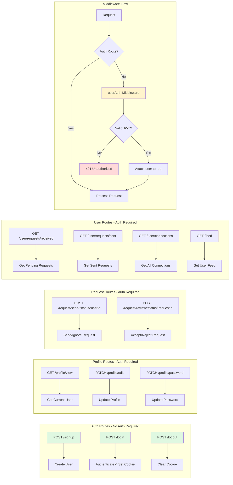

# DevConnect API Documentation

## Base URL
```
http://localhost:3000
```

## Authentication
Most endpoints require JWT authentication via HTTP-only cookies. The JWT token is automatically set when you log in and sent with every request.

### Cookie Details
- **Name**: `token`
- **Type**: HTTP-only (not accessible via JavaScript)
- **Expiry**: 7 days from login
- **Content**: JWT with user's `_id`

---

## Table of Contents
1. [Authentication Endpoints](#authentication-endpoints)
2. [Profile Endpoints](#profile-endpoints)
3. [Connection Request Endpoints](#connection-request-endpoints)
4. [User Endpoints](#user-endpoints)
5. [Error Responses](#error-responses)
6. [Data Models](#data-models)

---

## Authentication Endpoints

### 1. Sign Up

Creates a new user account.

**Endpoint:** `POST /signup`

**Authentication Required:** No

**Request Body:**
```json
{
  "firstName": "John",
  "lastName": "Doe",
  "emailId": "john.doe@example.com",
  "password": "SecurePass@123"
}
```

**Field Validations:**
- `firstName`: Required, 4-50 characters
- `lastName`: Optional
- `emailId`: Required, must be valid email format, unique
- `password`: Required, must be strong (min 8 chars, uppercase, lowercase, number, symbol)

**Success Response:**
```json
Status: 200 OK

"User added successfully"
```

**Error Responses:**
```json
Status: 400 Bad Request

"Error saving the user: firstName is a required field!"
"Error saving the user: Email is not valid!"
"Error saving the user: Password is not strong enough!"
"Error saving the user: E11000 duplicate key error" (email already exists)
```

**Example cURL:**
```bash
curl -X POST http://localhost:3000/signup \
  -H "Content-Type: application/json" \
  -d '{
    "firstName": "John",
    "lastName": "Doe",
    "emailId": "john@example.com",
    "password": "SecurePass@123"
  }'
```

---

### 2. Login

Authenticates a user and sets JWT cookie.

**Endpoint:** `POST /login`

**Authentication Required:** No

**Request Body:**
```json
{
  "emailId": "john.doe@example.com",
  "password": "SecurePass@123"
}
```

**Success Response:**
```json
Status: 200 OK
Set-Cookie: token=<JWT>; Path=/; Expires=<7 days from now>

{
  "_id": "507f1f77bcf86cd799439011",
  "firstName": "John",
  "lastName": "Doe",
  "emailId": "john.doe@example.com",
  "age": 28,
  "gender": "male",
  "photoUrl": "https://example.com/photo.jpg",
  "about": "Full-stack developer",
  "skills": ["JavaScript", "React", "Node.js"],
  "createdAt": "2024-01-15T10:30:00.000Z",
  "updatedAt": "2024-01-15T10:30:00.000Z"
}
```

**Error Responses:**
```json
Status: 400 Bad Request

"Error: Invalid Credentials!" (email not found)
"Error: Invalid Credentials!" (wrong password)
```

**Example cURL:**
```bash
curl -X POST http://localhost:3000/login \
  -H "Content-Type: application/json" \
  -c cookies.txt \
  -d '{
    "emailId": "john@example.com",
    "password": "SecurePass@123"
  }'
```

**Notes:**
- Password is never returned in response (hashed in database)
- JWT token stored in HTTP-only cookie
- Cookie expires in 7 days

---

### 3. Logout

Logs out the user by clearing the authentication cookie.

**Endpoint:** `POST /logout`

**Authentication Required:** No (but removes auth if present)

**Request Body:** None

**Success Response:**
```json
Status: 200 OK

"User successfully Logged Out!"
```

**Example cURL:**
```bash
curl -X POST http://localhost:3000/logout \
  -b cookies.txt
```

---

## Profile Endpoints

All profile endpoints require authentication.

### 4. View Profile

Returns the currently logged-in user's profile.

**Endpoint:** `GET /profile/view`

**Authentication Required:** Yes

**Request Body:** None

**Success Response:**
```json
Status: 200 OK

{
  "_id": "507f1f77bcf86cd799439011",
  "firstName": "John",
  "lastName": "Doe",
  "emailId": "john.doe@example.com",
  "age": 28,
  "gender": "male",
  "photoUrl": "https://example.com/photo.jpg",
  "about": "Full-stack developer passionate about building scalable applications",
  "skills": ["JavaScript", "React", "Node.js", "MongoDB"],
  "createdAt": "2024-01-15T10:30:00.000Z",
  "updatedAt": "2024-01-20T14:45:00.000Z"
}
```

**Error Responses:**
```json
Status: 401 Unauthorized

"Please Login first!"
```

```json
Status: 400 Bad Request

"ERROR: User not found!"
```

**Example cURL:**
```bash
curl -X GET http://localhost:3000/profile/view \
  -b cookies.txt
```

---

### 5. Edit Profile

Updates the user's profile information (excluding password).

**Endpoint:** `PATCH /profile/edit`

**Authentication Required:** Yes

**Request Body:**
```json
{
  "firstName": "John",
  "lastName": "Doe",
  "emailId": "john.new@example.com",
  "photoUrl": "https://example.com/new-photo.jpg",
  "age": 29,
  "gender": "male",
  "about": "Senior Full-stack developer",
  "skills": ["JavaScript", "TypeScript", "React", "Node.js"]
}
```

**Allowed Fields:**
- `firstName` (4-50 characters)
- `lastName`
- `emailId` (must be valid email)
- `photoUrl` (must be valid URL)
- `age` (minimum 18)
- `gender` (enum: "male", "female", "others")
- `about`
- `skills` (array of strings)

**Note:** You can update one or multiple fields in a single request.

**Success Response:**
```json
Status: 200 OK

{
  "message": "John, your profile was updated successfully",
  "data": {
    "_id": "507f1f77bcf86cd799439011",
    "firstName": "John",
    "lastName": "Doe",
    "emailId": "john.new@example.com",
    "age": 29,
    "gender": "male",
    "photoUrl": "https://example.com/new-photo.jpg",
    "about": "Senior Full-stack developer",
    "skills": ["JavaScript", "TypeScript", "React", "Node.js"],
    "createdAt": "2024-01-15T10:30:00.000Z",
    "updatedAt": "2024-01-21T09:15:00.000Z"
  }
}
```

**Error Responses:**
```json
Status: 401 Unauthorized

"Please Login first!"
```

```json
Status: 400 Bad Request

"ERROR: Invalid Edit Request!" (trying to edit password or other non-editable fields)
"ERROR: Invalid Photo URL: <url>"
"ERROR: Email is not valid!"
```

**Example cURL:**
```bash
curl -X PATCH http://localhost:3000/profile/edit \
  -H "Content-Type: application/json" \
  -b cookies.txt \
  -d '{
    "firstName": "John",
    "about": "Senior Full-stack developer",
    "skills": ["JavaScript", "TypeScript", "React"]
  }'
```

---

### 6. Update Password

Changes the user's password.

**Endpoint:** `PATCH /profile/password`

**Authentication Required:** Yes

**Request Body:**
```json
{
  "oldPassword": "OldSecurePass@123",
  "newPassword": "NewSecurePass@456"
}
```

**Field Validations:**
- `oldPassword`: Required, must match current password
- `newPassword`: Required, must be strong password

**Success Response:**
```json
Status: 200 OK

"Password updated successfully!"
```

**Error Responses:**
```json
Status: 401 Unauthorized

"Please Login first!"
```

```json
Status: 400 Bad Request

"ERROR: Old Password Incorrect!"
"ERROR: New Password is not strong enough!"
```

**Example cURL:**
```bash
curl -X PATCH http://localhost:3000/profile/password \
  -H "Content-Type: application/json" \
  -b cookies.txt \
  -d '{
    "oldPassword": "OldSecurePass@123",
    "newPassword": "NewSecurePass@456"
  }'
```

**Security Notes:**
- Old password must be verified before update
- New password is hashed with bcrypt (10 rounds)
- Strong password requirement enforced

---

## Connection Request Endpoints

All connection request endpoints require authentication.

### 7. Send Connection Request

Sends a connection request or ignores a user.

**Endpoint:** `POST /request/send/:status/:toUserId`

**Authentication Required:** Yes

**URL Parameters:**
- `status`: Either `"interested"` (send request) or `"ignored"` (ignore user)
- `toUserId`: MongoDB ObjectId of the target user

**Request Body:** None

**Success Response:**
```json
Status: 200 OK

{
  "message": "Connection Request Sent Successfully!",
  "data": {
    "_id": "65a1234567890abcdef12345",
    "fromUserId": "507f1f77bcf86cd799439011",
    "toUserId": "507f1f77bcf86cd799439022",
    "status": "interested",
    "createdAt": "2024-01-21T10:30:00.000Z",
    "updatedAt": "2024-01-21T10:30:00.000Z"
  }
}
```

**Error Responses:**
```json
Status: 401 Unauthorized

"Please Login first!"
```

```json
Status: 400 Bad Request

{
  "message": "Invalid status types: invalid_status"
}
```

```json
Status: 404 Not Found

"User not found!"
```

```json
Status: 400 Bad Request

"ERROR: Connection request Already Exists!"
"ERROR: Cannot send connection request to yourself!"
```

**Example cURL:**
```bash
# Send connection request
curl -X POST http://localhost:3000/request/send/interested/507f1f77bcf86cd799439022 \
  -b cookies.txt

# Ignore a user
curl -X POST http://localhost:3000/request/send/ignored/507f1f77bcf86cd799439022 \
  -b cookies.txt
```

**Business Rules:**
- Cannot send request to yourself
- Cannot send duplicate requests (checks all statuses)
- Target user must exist in database
- Only two valid statuses: `"interested"` or `"ignored"`

---

### 8. Review Connection Request

Accepts or rejects a received connection request.

**Endpoint:** `POST /request/review/:status/:requestId`

**Authentication Required:** Yes

**URL Parameters:**
- `status`: Either `"accepted"` or `"rejected"`
- `requestId`: MongoDB ObjectId of the connection request

**Request Body:** None

**Success Response:**
```json
Status: 200 OK

{
  "message": "Connection Request accepted",
  "data": {
    "_id": "65a1234567890abcdef12345",
    "fromUserId": "507f1f77bcf86cd799439022",
    "toUserId": "507f1f77bcf86cd799439011",
    "status": "accepted",
    "createdAt": "2024-01-21T10:30:00.000Z",
    "updatedAt": "2024-01-21T11:00:00.000Z"
  }
}
```

**Error Responses:**
```json
Status: 401 Unauthorized

"Please Login first!"
```

```json
Status: 400 Bad Request

{
  "message": "Status not allowed!"
}
```

```json
Status: 404 Not Found

{
  "message": "Connection request not found!"
}
```

**Example cURL:**
```bash
# Accept a request
curl -X POST http://localhost:3000/request/review/accepted/65a1234567890abcdef12345 \
  -b cookies.txt

# Reject a request
curl -X POST http://localhost:3000/request/review/rejected/65a1234567890abcdef12345 \
  -b cookies.txt
```

**Business Rules:**
- Request must exist in database
- Request must be sent TO the logged-in user (toUserId)
- Request status must be `"interested"` (pending state)
- Only two valid statuses: `"accepted"` or `"rejected"`
- Cannot review requests you sent (only requests sent to you)

---

## User Endpoints

All user endpoints require authentication.

### 9. Get Received Requests

Returns all pending connection requests sent to the logged-in user.

**Endpoint:** `GET /user/requests/received`

**Authentication Required:** Yes

**Query Parameters:** None

**Success Response:**
```json
Status: 200 OK

{
  "message": "Data fetched successfully!",
  "connectionRequests": [
    {
      "_id": "65a1234567890abcdef12345",
      "fromUserId": {
        "firstName": "Jane",
        "lastName": "Smith",
        "photoUrl": "https://example.com/jane.jpg",
        "gender": "female",
        "age": 26,
        "about": "Frontend developer specializing in React",
        "skills": ["React", "JavaScript", "CSS"]
      },
      "toUserId": "507f1f77bcf86cd799439011",
      "status": "interested",
      "createdAt": "2024-01-21T10:30:00.000Z",
      "updatedAt": "2024-01-21T10:30:00.000Z"
    },
    {
      "_id": "65a1234567890abcdef12346",
      "fromUserId": {
        "firstName": "Mike",
        "lastName": "Johnson",
        "photoUrl": "https://example.com/mike.jpg",
        "gender": "male",
        "age": 30,
        "about": "DevOps engineer",
        "skills": ["Docker", "Kubernetes", "AWS"]
      },
      "toUserId": "507f1f77bcf86cd799439011",
      "status": "interested",
      "createdAt": "2024-01-21T09:15:00.000Z",
      "updatedAt": "2024-01-21T09:15:00.000Z"
    }
  ]
}
```

**Error Responses:**
```json
Status: 401 Unauthorized

"Please Login first!"
```

```json
Status: 400 Bad Request

"ERROR: <error message>"
```

**Example cURL:**
```bash
curl -X GET http://localhost:3000/user/requests/received \
  -b cookies.txt
```

**Notes:**
- Only returns requests with status `"interested"` (pending)
- `fromUserId` populated with sender's safe data (no password)
- Sorted by creation date (newest first by default)

---

### 10. Get Sent Requests

Returns all pending connection requests sent by the logged-in user.

**Endpoint:** `GET /user/requests/sent`

**Authentication Required:** Yes

**Query Parameters:** None

**Success Response:**
```json
Status: 200 OK

{
  "message": "Data fetched successfully!",
  "connectionRequests": [
    {
      "_id": "65a1234567890abcdef12347",
      "fromUserId": "507f1f77bcf86cd799439011",
      "toUserId": {
        "firstName": "Sarah",
        "lastName": "Williams",
        "photoUrl": "https://example.com/sarah.jpg",
        "gender": "female",
        "age": 27,
        "about": "Backend developer with Node.js expertise",
        "skills": ["Node.js", "Express", "MongoDB"]
      },
      "status": "interested",
      "createdAt": "2024-01-21T08:00:00.000Z",
      "updatedAt": "2024-01-21T08:00:00.000Z"
    }
  ]
}
```

**Error Responses:**
```json
Status: 401 Unauthorized

"Please Login first!"
```

```json
Status: 400 Bad Request

"ERROR: <error message>"
```

**Example cURL:**
```bash
curl -X GET http://localhost:3000/user/requests/sent \
  -b cookies.txt
```

**Notes:**
- Only returns requests with status `"interested"` (pending)
- `toUserId` populated with recipient's safe data
- Shows requests waiting for response

---

### 11. Get Connections

Returns all accepted connections for the logged-in user.

**Endpoint:** `GET /user/connections`

**Authentication Required:** Yes

**Query Parameters:** None

**Success Response:**
```json
Status: 200 OK

{
  "data": [
    {
      "firstName": "Alice",
      "lastName": "Brown",
      "photoUrl": "https://example.com/alice.jpg",
      "gender": "female",
      "age": 25,
      "about": "UI/UX Designer turned Frontend Developer",
      "skills": ["Figma", "React", "TypeScript"]
    },
    {
      "firstName": "Bob",
      "lastName": "Davis",
      "photoUrl": "https://example.com/bob.jpg",
      "gender": "male",
      "age": 32,
      "about": "Full-stack developer with 8 years experience",
      "skills": ["Python", "Django", "React", "PostgreSQL"]
    }
  ]
}
```

**Error Responses:**
```json
Status: 401 Unauthorized

"Please Login first!"
```

```json
Status: 400 Bad Request

"ERROR: <error message>"
```

**Example cURL:**
```bash
curl -X GET http://localhost:3000/user/connections \
  -b cookies.txt
```

**Logic Explanation:**
1. Finds all connection requests where:
   - (You sent OR you received) AND
   - Status is `"accepted"`
2. Returns only the OTHER user's data (not your own)
3. For requests you sent: returns `toUserId`
4. For requests you received: returns `fromUserId`

---

### 12. Get Feed

Returns a list of users to display in the feed (potential connections).

**Endpoint:** `GET /feed`

**Authentication Required:** Yes

**Query Parameters:**
- `page` (optional): Page number, default `1`
- `limit` (optional): Items per page, default `10`, max `50`

**Success Response:**
```json
Status: 200 OK

{
  "data": [
    {
      "firstName": "Emma",
      "lastName": "Wilson",
      "photoUrl": "https://example.com/emma.jpg",
      "gender": "female",
      "age": 28,
      "about": "Mobile app developer specializing in React Native",
      "skills": ["React Native", "JavaScript", "Swift"]
    },
    {
      "firstName": "David",
      "lastName": "Martinez",
      "photoUrl": "https://example.com/david.jpg",
      "gender": "male",
      "age": 29,
      "about": "Data scientist and ML engineer",
      "skills": ["Python", "TensorFlow", "Pandas"]
    }
  ]
}
```

**Error Responses:**
```json
Status: 401 Unauthorized

"Please Login first!"
```

```json
Status: 400 Bad Request

{
  "message": "<error message>"
}
```

**Example cURL:**
```bash
# Default pagination (page 1, 10 items)
curl -X GET http://localhost:3000/feed \
  -b cookies.txt

# Custom pagination
curl -X GET "http://localhost:3000/feed?page=2&limit=20" \
  -b cookies.txt
```

**Filtering Logic:**
1. Finds all connection requests involving you (any status)
2. Extracts all user IDs from these requests
3. Excludes these users from results
4. Excludes your own profile
5. Returns remaining users (new people to connect with)

**Excluded Users:**
- Users you've sent requests to (any status)
- Users who've sent requests to you (any status)
- Yourself
- This ensures you only see "fresh" profiles

**Pagination:**
- Default: 10 users per page
- Maximum: 50 users per page
- Use `page` and `limit` to navigate through results

---

## Error Responses

### Standard Error Format

All errors follow this general pattern:

```json
Status: <HTTP Status Code>

"ERROR: <error message>"
// or
{
  "message": "<error message>"
}
```

### Common HTTP Status Codes

| Code | Meaning | When It Happens |
|------|---------|-----------------|
| 200 | OK | Request succeeded |
| 400 | Bad Request | Validation error, invalid input |
| 401 | Unauthorized | Not logged in, invalid/expired JWT |
| 404 | Not Found | Resource doesn't exist |
| 500 | Internal Server Error | Unexpected server error |

### Common Error Scenarios

**1. Not Authenticated**
```json
Status: 401 Unauthorized

"Please Login first!"
```
**Solution:** Login via `POST /login` to get JWT cookie

**2. Invalid JWT**
```json
Status: 400 Bad Request

"ERROR: jwt malformed"
"ERROR: jwt expired"
```
**Solution:** Login again to get new token

**3. User Not Found**
```json
Status: 400 Bad Request

"ERROR: User not found!"
```
**Solution:** Check if user exists, may have been deleted

**4. Validation Errors**
```json
Status: 400 Bad Request

"ERROR: firstName is a required field!"
"ERROR: Email is not valid!"
"ERROR: Password is not strong enough!"
```
**Solution:** Check request body against field validations

**5. Duplicate Connection Request**
```json
Status: 400 Bad Request

"ERROR: Connection request Already Exists!"
```
**Solution:** Check if request already sent (any status)

---

## Data Models

### User Model

```javascript
{
  "_id": ObjectId,              // Auto-generated MongoDB ID
  "firstName": String,          // Required, 4-50 chars
  "lastName": String,           // Optional
  "emailId": String,            // Required, unique, validated
  "password": String,           // Required, hashed with bcrypt
  "age": Number,                // Optional, min 18
  "gender": String,             // Optional, enum: ["male", "female", "others"]
  "photoUrl": String,           // Optional, validated URL
  "about": String,              // Optional, default: "Hey there! I am a dev!"
  "skills": [String],           // Optional array
  "createdAt": Date,            // Auto-generated timestamp
  "updatedAt": Date             // Auto-updated timestamp
}
```

**Field Details:**

| Field | Type | Required | Validation | Default |
|-------|------|----------|------------|---------|
| firstName | String | Yes | 4-50 characters | - |
| lastName | String | No | - | - |
| emailId | String | Yes | Valid email, unique | - |
| password | String | Yes | Strong password (8+ chars, upper, lower, number, symbol) | - |
| age | Number | No | Minimum 18 | - |
| gender | String | No | "male", "female", or "others" | - |
| photoUrl | String | No | Valid URL format | Placeholder image |
| about | String | No | - | "Hey there! I am a dev!" |
| skills | Array | No | Array of strings | [] |

**Password Security:**
- Stored as bcrypt hash (10 rounds)
- Never returned in API responses
- Minimum 8 characters
- Must contain: uppercase, lowercase, number, special character

---

### ConnectionRequest Model

```javascript
{
  "_id": ObjectId,              // Auto-generated MongoDB ID
  "fromUserId": ObjectId,       // User who sent the request (ref: User)
  "toUserId": ObjectId,         // User who received the request (ref: User)
  "status": String,             // Required, enum: ["ignored", "interested", "accepted", "rejected"]
  "createdAt": Date,            // Auto-generated timestamp
  "updatedAt": Date             // Auto-updated timestamp
}
```

**Status Values:**

| Status | Meaning | Set By | Next Actions |
|--------|---------|--------|--------------|
| ignored | User A ignored User B's profile | User A (sender) | None (terminal state) |
| interested | User A sent request to User B | User A (sender) | User B can accept/reject |
| accepted | User B accepted User A's request | User B (receiver) | Now connected |
| rejected | User B rejected User A's request | User B (receiver) | None (terminal state) |

**Indexes:**
- Compound index on `{fromUserId: 1, toUserId: 1}` for fast lookups
- Ensures efficient queries for existing requests

**Validation Rules:**
- `fromUserId` ≠ `toUserId` (enforced by pre-save hook)
- Only one request allowed per user pair (any status)
- Both users must exist in database

---

## Quick Reference

### Authentication Endpoints
| Method | Endpoint | Auth Required | Purpose |
|--------|----------|---------------|---------|
| POST | /signup | No | Create account |
| POST | /login | No | Get JWT token |
| POST | /logout | No | Clear token |

### Profile Endpoints
| Method | Endpoint | Auth Required | Purpose |
|--------|----------|---------------|---------|
| GET | /profile/view | Yes | Get current user |
| PATCH | /profile/edit | Yes | Update profile |
| PATCH | /profile/password | Yes | Change password |

### Connection Request Endpoints
| Method | Endpoint | Auth Required | Purpose |
|--------|----------|---------------|---------|
| POST | /request/send/:status/:userId | Yes | Send/ignore request |
| POST | /request/review/:status/:requestId | Yes | Accept/reject request |

### User Endpoints
| Method | Endpoint | Auth Required | Purpose |
|--------|----------|---------------|---------|
| GET | /user/requests/received | Yes | Get pending requests (to you) |
| GET | /user/requests/sent | Yes | Get pending requests (from you) |
| GET | /user/connections | Yes | Get all connections |
| GET | /feed | Yes | Get potential connections |

---

## Diagrams

### API Routes Overview



### Authentication Flow

```mermaid
sequenceDiagram
    participant U as User/Browser
    participant L as Login Component
    participant A as Axios
    participant E as Express Server
    participant M as Auth Middleware
    participant DB as MongoDB
    
    U->>L: Enter credentials
    L->>A: POST /login
    A->>E: {emailId, password}
    
    E->>DB: findOne({emailId})
    DB-->>E: User document
    
    alt User found
        E->>E: validatePassword()
        alt Password valid
            E->>E: user.getJWT()
            Note over E: Creates JWT with _id
            E->>E: Set cookie
            E-->>A: 200 + User data + Cookie
            A-->>L: User data
            L->>L: dispatch(addUser)
            L->>L: navigate("/")
        else Invalid password
            E-->>A: 400 "Invalid Credentials"
            A-->>L: Error
            L->>U: Show error
        end
    else User not found
        E-->>A: 400 "Invalid Credentials"
        A-->>L: Error
        L->>U: Show error
    end
    
    rect rgb(0, 0, 0)
    Note over U,DB: Protected Route Access
    U->>A: GET /profile/view
    A->>E: Request + Cookie
    E->>M: userAuth middleware
    M->>M: Extract JWT from cookie
    M->>M: Verify JWT
    M->>DB: findById(_id)
    DB-->>M: User document
    M->>M: req.user = user
    M->>E: next()
    E-->>A: User data
    end
```



### Connection Request Flow

```mermaid
sequenceDiagram
    participant U1 as User A
    participant F as Feed Component
    participant U2 as User B
    participant R as Requests Component
    participant API as Express API
    participant DB as MongoDB
    
    rect rgb(0, 0, 0)
    Note over U1,DB: Sending Connection Request
    U1->>F: Browse feed
    F->>API: GET /feed
    API->>DB: Find users excluding<br/>existing connections
    DB-->>API: List of users
    API-->>F: User B profile
    F->>U1: Display User B
    U1->>F: Click "Send Request"
    F->>API: POST /request/send/interested/:toUserId
    API->>DB: Check existing request
    alt No existing request
        API->>DB: Create ConnectionRequest<br/>{fromUserId: A, toUserId: B, status: 'interested'}
        DB-->>API: Request created
        API-->>F: Success
        F->>F: Remove from feed
    else Request exists
        API-->>F: Error "Request already exists"
    end
    end
    
    rect rgb(0, 0, 0)
    Note over U2,DB: Reviewing Connection Request
    U2->>R: View requests
    R->>API: GET /user/requests/received
    API->>DB: Find requests<br/>{toUserId: B, status: 'interested'}
    DB-->>API: List of requests
    API-->>R: Requests with sender info
    R->>U2: Display User A's request
    
    alt User accepts
        U2->>R: Click "Accept"
        R->>API: POST /request/review/accepted/:requestId
        API->>DB: Update request status to 'accepted'
        DB-->>API: Updated
        API-->>R: Success
        R->>R: Remove from list
    else User rejects
        U2->>R: Click "Reject"
        R->>API: POST /request/review/rejected/:requestId
        API->>DB: Update request status to 'rejected'
        DB-->>API: Updated
        API-->>R: Success
        R->>R: Remove from list
    end
    end
```



---

## Notes

- All dates are in ISO 8601 format
- MongoDB ObjectIds are 24-character hexadecimal strings
- JWT secret: should be in environment variables in production
- CORS enabled for FRONTEND_URL
- Database: MongoDB Atlas cluster

---

**End of Documentation**